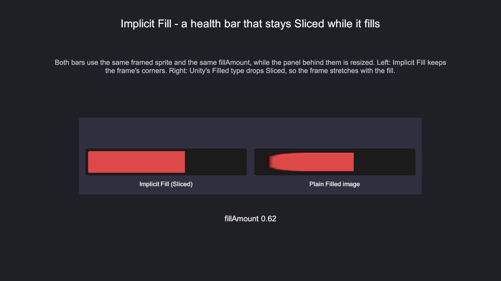
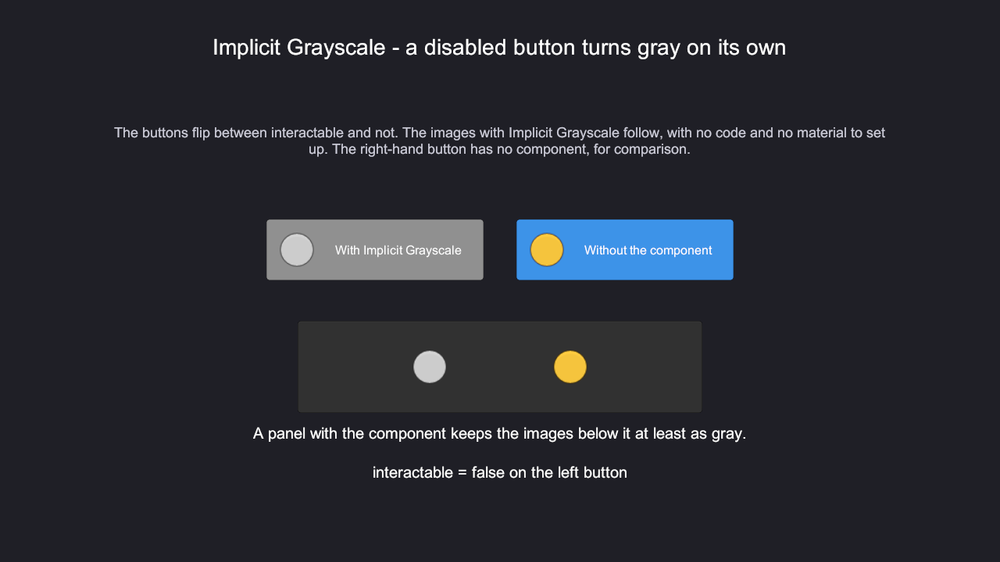
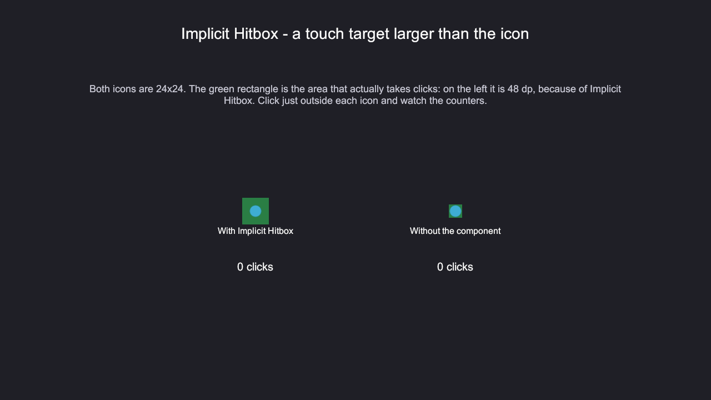
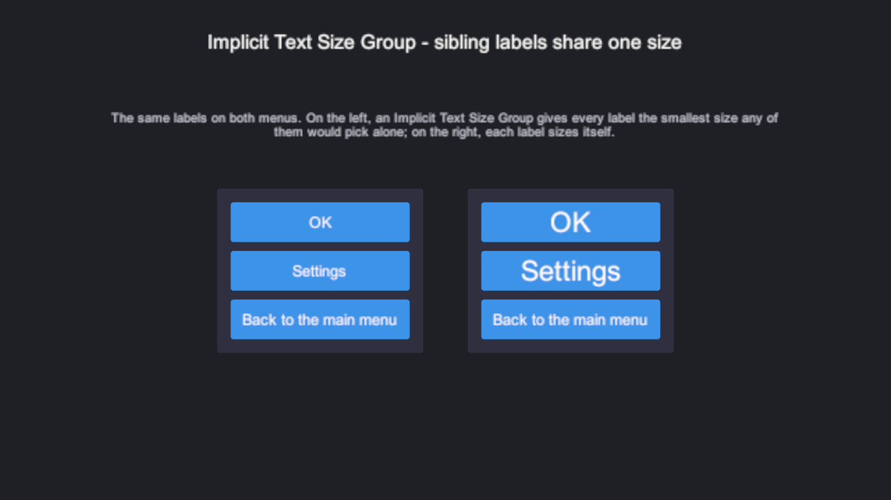
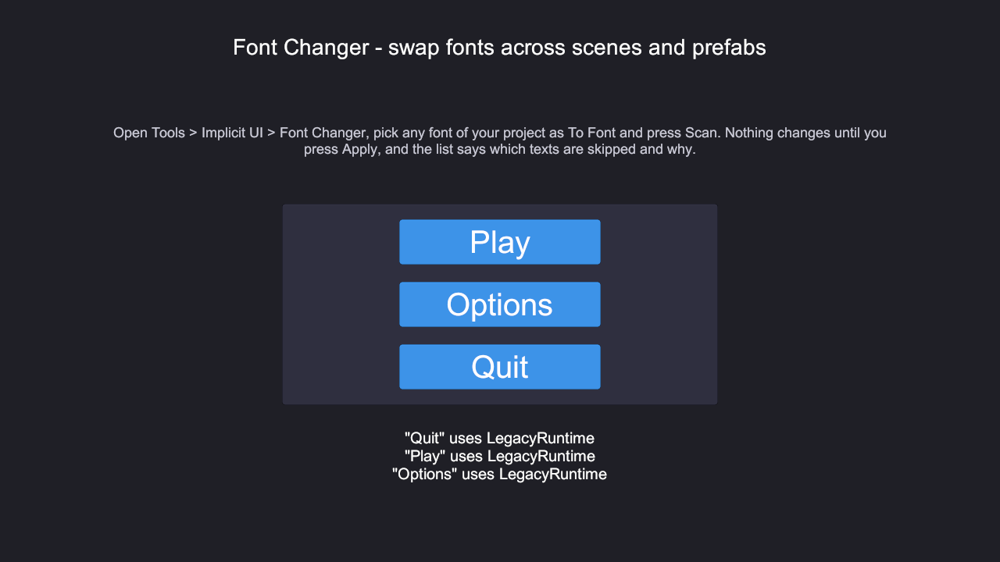

# Implicit UI

Small, practical improvements for Unity UI (uGUI), built on one rule: **adding the component should be
enough**. No material to drag in, no setup prefab, no central asset to configure.

[](https://github.com/bionics07/Implicit-UI/actions/workflows/tests.yml)
[](LICENSE)
[](#compatibility)

Every feature below has a sample scene in the Package Manager window; the screenshots come from them.

## What you get

### Implicit Fill

Fills an Image that stays **Sliced** or **Tiled**. Unity's own Filled type drops both, so a framed health bar
stretches its corners as it resizes; this one keeps them. It uses the Image's own Fill Amount, Fill Method and
Fill Origin, so code that animates `image.fillAmount` keeps working, and changing the fill never rebuilds layout.

```csharp
image.fillAmount = health / maxHealth;   // the same line you already had
```



### Implicit Grayscale

Turns an Image or RawImage gray, **on its own when the button it belongs to is disabled**. No material to set up:
the gray amount travels in the vertex data, so images with different amounts still batch together. Optional tint
over the gray for sepia or cold looks, and its inspector shows which button or parent image controls it.



### Implicit Hitbox

Keeps small graphics easy to tap: a **minimum touch size in dp** (48 by default, the size Android recommends),
applied while the game runs on top of Unity's own Raycast Padding. It also brings an alpha hit test that works
with padding and sprite atlases, warns once instead of on every touch when the texture cannot be read, and
enables Read/Write with one click - telling you what it costs in memory first.



### Implicit Text Size Group

Put it on the parent and every auto-sized text below it takes **the smallest size any of them would pick alone**,
so "OK", "Settings" and "Back to the main menu" stop being three different sizes. Works with legacy Text and
TextMeshPro, mixed. In the Editor it is a preview: the original values go back before anything is saved.



### Font Changer

`Tools > Implicit UI > Font Changer` changes the font of every text in the open scenes or in a folder of prefabs,
after a **dry run** that lists each text with a checkbox. Values a prefab instance inherits are left to the
prefab instead of becoming an override on every instance, TextMeshPro materials are checked against the target
font, and material presets are kept unless you choose to replace them.



## Install

**OpenUPM**

```
openupm add com.bionics.implicitui
```

**Package Manager, from a Git URL** (Add package from git URL...):

```
https://github.com/bionics07/Implicit-UI.git?path=Packages/com.bionics.implicitui
```

**Asset Store**: search for *Implicit UI*.

Samples are in the Package Manager window, one per feature.

## Compatibility

| | |
|---|---|
| Unity | 2021.3 and newer |
| Tested on | 2021.3, 2022.3, 6000.0 and 6000.6, on every push |
| Render pipelines | Built-in, URP and HDRP, in Screen Space Overlay, Screen Space Camera and World Space |
| TextMeshPro | Optional. Used only by the Text Size Group and the Font Changer, and only when TMP is installed |
| Dependencies | `com.unity.ugui` only |

The grayscale shader was checked by hand in the three render pipelines, and the package was run on an Android
device (IL2CPP, ARM64) and on a Windows player.

## Support

Bug, question or idea: [open an issue](https://github.com/bionics07/Implicit-UI/issues).

If it saved you an afternoon, you can [buy me a coffee](https://ko-fi.com/bionics07). Entirely optional.

## License

MIT - see [LICENSE](LICENSE). The grayscale shader derives from Unity's built-in `UI-Default` shader, also MIT;
see [Third Party Notices](Packages/com.bionics.implicitui/Third%20Party%20Notices.md).
